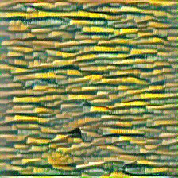
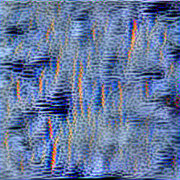

## Overview
This repository contains the code re-implementing the following papers on learning second-order represntations using CNNs in Pytorch ( > 1.1.0). The links to their project webpages are provided and their original imeplementations in Matlab with MatConVnet can be found in the project webpages. 

1. [Bilinear Convolutional Neural Networks for Fine-grained Visual Recognition](http://vis-www.cs.umass.edu/bcnn/), Tsung-Yu Lin, Aruni RoyChowdhury and Subhransu Maji, PAMI 2017
2. [Visualizing and Understanding Deep Texture Representations](http://vis-www.cs.umass.edu/bcnn/), Tsung-Yu Lin, and Subhransu Maji, CVPR 2016
3. [Improved Bilinear Pooling with CNNs](http://vis-www.cs.umass.edu/bcnn/), Tsung-Yu Lin, and Subhransu Maji, BMVC 2017
4. [Second-order Democratic Aggregation](http://vis-www.cs.umass.edu/o2dp/), Tsung-Yu Lin, Subhransu Maji and Piotr Koniusz, ECCV 2018

The series of works investigate the models using second-order pooling of convolutional features and study the techniques to improve the representation power. We reproduced the results using the symmetric BCNN models, which represent images as covariance matrices of CNN activations. More details can be found in my PhD [thesis](http://vis-www.cs.umass.edu/papers/tsungyu_thesis.pdf).

In this repository, we provided the code for:
1. training BCNN models
2. training Improved BCNN models (Improving BCNN with matrix square root normalization)
3. training the CNN models with second-order democratic aggregation
4. inverting fine-grained categories with BCNN representations

## Datasets
Download the following datasets and point the correpsonding entries in `config.py` to the location where you download the data.
* Birds: [CUB-200-2011 dataset](http://www.vision.caltech.edu/visipedia/CUB-200-2011.html).
* Aircrafts: [FGVC aircraft dataset](http://www.robots.ox.ac.uk/~vgg/data/oid/)
* Cars: [Stanford cars dataset](http://ai.stanford.edu/~jkrause/cars/car_dataset.html)

The results obtained from using the code in this repository are summarized in the following table. Unlike the numbers reported in original paper, the results of accuracy reported here are obtained by the softmax classifier instead of SVM.

| Datasets    | BCNN [VGG-D]  |   Improved BCNN [VGG-D]   |
| :---        |    :----:     |           :---:           |
| Birds       |    84.1%      |           85.5%           |
| Cars        |    90.5%      |           92.5%           |
| Aircrafts   |    87.5%      |           90.7%           |

## Training BCNN
The following command is used to train the BCNN model with VGG-D as backbone. 

    python train.py --lr 1e-4 --optimizer adam --exp bcnn_vgg --dataset cub --batch_size 16 --model_names_list vgg
   
This will construct the BCNN models with ImageNet pretrained VGG-D as a backbone network and start the training of softmax layer to initialize the weights of classifier. You will see the output as follow:

    Iteration 624/9365
    ----------
    Train Loss: 4.3640 Acc: 0.1890
    Validation Loss: 3.2716 Acc: 0.3643
    Iteration 1249/9365
    ----------
    Train Loss: 2.3581 Acc: 0.5791
    Validation Loss: 2.0965 Acc: 0.5865
    Iteration 1874/9365
    ----------
    Train Loss: 1.4570 Acc: 0.7669
    Validation Loss: 1.6335 Acc: 0.6717

After the initialization of softmax classifier is done, the process of end-to-end fine-tuning will start automatically. The intermediate checkpoints, models, and the results can be found in the folder `../exp/cub/bcnn_vgg`. We used the split for training from Birds and Cars, and the (training + val) from Aircrafts during the training phases. This code base serves as the reimplementation of BCNN representations in Pytorch. For simplicity to provide a val set, we just put the 'test' set as val set in the code due to the lack of properly created validation set. The test accuracy can be read off direcly from the log file `train_history.txt`. Providing test set as val during training is tricky and should be strictly avoided for conducting experiments.

## Training Improved BCNN
Improved BCNN models improve BCNN models by normalizing the spectrum of covariance representations with matrix square root. The following command is used to train the Improved-BCNN models with VGG-D as backbone. 
    
    python train.py --lr 1e-4 --optimizer adam --matrix_sqrt_iter 5 --exp impbcnn_vgg --batch_size 16 --dataset cub --model_names_list vgg
    
The intermediate checkpoints, models, and the results can be found in the folder `../exp/cub/impbcnn_vgg`. The accuracy could be further improved by using a deeper backbone network such as DenseNet in some cases. As using full covariance matrices of high-dimensional DesnNet features (1920 x 1920) is prohibited, we add a layer to reduce the feature dimension before computing second order representations. The target dimension of the projectin can be given by the argument `proj_dim`. The following command is used to train the Improved-BCNN models with DenseNet:

    python train.py --lr 1e-4 --optimizer adam --matrix_sqrt_iter 5 --exp impbcnn_desnsenet --batch_size 16 --dataset cub --model_names_list densenet --proj_dim 128 
    
| Datasets    |   Birds  |   Cars   |   Aircrafts    |
| :---        |  :----:  |   :---:  |     :--:       |
| Birds       |   87.5%  |   92.9%  |     90.6%      | 

## Training Second-order democratic aggregation
The following command is used to train second-order democratic pooling with VGG-D as backbone. 

    python train.py --lr 1e-4 --optimizer adam --exp democratic_vgg --dataset cub --batch_size 16 --pooling_method gamma_demo --model_names_list vgg
    
The intermediate checkpoints, models, and the results can be found in the folder `../exp/cub/democratic_vgg`. The 

## Visualizing the invariance of fine-grained categories by inversion of BCNN models
The visual properties of fine-grained categories captured by BCNN models can be visualized by finding the maximal images that are confidently predicted as the target categories. We can achieve these images by 'inverting' the models. The following command is used to run the inversion of BCNN models for Birds dataset:
    
    python inversion.py --exp_dir invert_categories
    
The code starts with training softmax classifers on top of BCNN representations extracted from the layers `{relu2_2, relu3_3, relu4_3, relu5_3}` and then find the images maximizing the prediction scores for each categories via LGFBS. You can find the output images as shown in the following in the folder: `../exp_inversion/cub/invert_categories/inv_output`.

   
   
   
